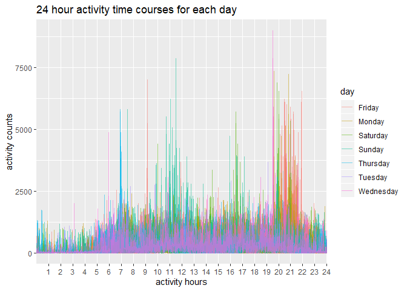

p8105\_hw3\_YJ2580
================
yj2580
10/7/2019

## Problem 1

This data has 1384617 entries and 15 variables in total. Each row of
this table represents a detailed case of a specific purchasing. Key
variables are: order\_id: order identifier product\_id: product
identifier add\_to\_cart\_order: order in which each product was added
to cart reordered: 1 if this prodcut has been ordered by this user in
the past, 0 otherwise user\_id: customer identifier eval\_set: which
evaluation set this order belongs in (Note that the data for use in this
class is exclusively from the “train” eval\_set) order\_number: the
order sequence number for this user (1=first, n=nth) order\_dow: the day
of the week on which the order was placed order\_hour\_of\_day: the hour
of the day on which the order was placed days\_since\_prior\_order: days
since the last order, capped at 30, NA if order\_number=1 product\_name:
name of the product aisle\_id: aisle identifier department\_id:
department identifier aisle: the name of the aisle department: the name
of the department

For example, in the first row, the user 112108 made an order at 10 am on
Thursday. The product is “Bulgarian Yogurt” from aisle “Yogurt”,
department “Dairy Eggs”. The user had purchased this product before. It
had been 9 days since the last
order.

``` r
# create a dataframe from instacart grouped by aisles and summarize the count of each aisle
aisle = instacart %>%
  group_by(aisle) %>%
  summarize(n = n())
# the total number of aisles
nrow(aisle)
```

    ## [1] 134

``` r
# which aisles are the most items ordered from
aisle %>%
  arrange(desc(n)) %>%
  head(1) %>%
  pull(aisle)
```

    ## [1] "fresh vegetables"

Comment: there are 134 aisles, amongst which fresh vegetables are the
most items ordered from.

``` r
#choose aisles with more than 10000 items
aisle_new = aisle %>%
  filter(n>10000)
ggplot(aisle_new, aes(x = aisle, y = n)) + 
  geom_bar(stat = "identity")+
  theme(axis.text.x = element_text(angle = 45, hjust = 1)) + 
  labs(x = "Aisle", y = "The number of items", title = " The number of items ordered in each aisle") 
```

<!-- --> Comments: There
are 39 aisles with more than 10000 items ordered in total. As shown in
the plot, items of fresh fruits and fresh vegetables which had been
ordered obviously outnumbered those of other aisles, with around 150000
items. Items from majority of aisles had been ordered for below 25000
times.

``` r
# find the three most popular items in aisles "baking ingredients"
bake_ingre = instacart %>%
  filter(aisle == "baking ingredients") %>%
  group_by(product_name) %>%
  summarise(n = n()) %>%
  arrange(desc(n)) %>%
  head(3) %>%
  mutate(aisle = "baking ingredients")
# find the three most popular items in aisles “dog food care”
dog_food = instacart %>%
  filter(aisle == "dog food care") %>%
  group_by(product_name) %>%
  summarise(n = n()) %>%
  arrange(desc(n)) %>%
  head(3) %>%
  mutate(aisle = "dog food care")
# find the three most popular items in aisles “packaged vegetables fruits”
pack_vege = instacart %>%
  filter(aisle == "packaged vegetables fruits") %>%
  group_by(product_name) %>%
  summarise(n = n()) %>%
  arrange(desc(n)) %>%
  head(3) %>%
  mutate(aisle = "packaged vegetables fruits")
# combine three tables, the number of items is ordered
rbind(bake_ingre, dog_food, pack_vege) %>%
  arrange(n) %>%
  knitr::kable()
```

| product\_name                                 |    n | aisle                      |
| :-------------------------------------------- | ---: | :------------------------- |
| Small Dog Biscuits                            |   26 | dog food care              |
| Organix Chicken & Brown Rice Recipe           |   28 | dog food care              |
| Snack Sticks Chicken & Rice Recipe Dog Treats |   30 | dog food care              |
| Cane Sugar                                    |  336 | baking ingredients         |
| Pure Baking Soda                              |  387 | baking ingredients         |
| Light Brown Sugar                             |  499 | baking ingredients         |
| Organic Blueberries                           | 4966 | packaged vegetables fruits |
| Organic Raspberries                           | 5546 | packaged vegetables fruits |
| Organic Baby Spinach                          | 9784 | packaged vegetables fruits |

Comments: The three most popular items in aisles “dog food care” are
Small Dog Biscuits, Organix Chicken & Brown Rice Recipe, and Snack
Sticks Chicken & Rice Recipe Dog Treats, with the amount of 26, 28, and
30 respectively. This aisle sold least items compared with the other
two. The three most popular items in aisles “baking ingredients” are
Cane Sugar, Pure Baking Soda, and Light Brown Sugar, with the amount of
336, 387, and 499 respectively. The three most popular items in aisles
“packaged vegetables fruits” are Organic Blueberries, Organic
Raspberries, Organic Baby Spinach, with the amount of 4966, 5546, and
9784 respectively. This aisle sold most items compared with the other
two.

``` r
# show the mean hour of the day at which Pink Lady apples are ordered on each day of the week
pink_lady = instacart %>%
  filter(product_name %like% "Pink Lady Apples") %>%
  group_by(order_dow) %>%
  summarize(mean_hour_of_day = mean(order_hour_of_day)) %>%
  mutate(product_name = "Pink Lady Apples")
# show the mean hour of the day at which Coffee Ice Cream are ordered on each day of the week
coff_ice = instacart %>%
  filter(product_name %like% "Coffee Ice Cream") %>%
  group_by(order_dow) %>%
  summarize(mean_hour_of_day = mean(order_hour_of_day)) %>%
  mutate(product_name = "Coffee Ice Cream")
# combine two results and produce a 2 x 7 table
rbind(pink_lady, coff_ice) %>%
  pivot_wider(
    names_from = order_dow,
    values_from = mean_hour_of_day
  ) %>%
  knitr::kable()
```

| product\_name    |        0 |        1 |        2 |        3 |    4 |        5 |        6 |
| :--------------- | -------: | -------: | -------: | -------: | ---: | -------: | -------: |
| Pink Lady Apples | 13.15000 | 11.38889 | 12.06000 | 14.02703 | 12.0 | 12.80000 | 12.10526 |
| Coffee Ice Cream | 13.48571 | 13.72727 | 15.29167 | 15.31818 | 14.8 | 12.22727 | 13.92105 |

Comments: Pink Lady Apples were ordered from 11:00 to 14:00
approximately, while coffee ice cream were ordered from 12:00 to 15:30
approximately.

## Problem 2

``` r
# Create a dataframe
brfss = brfss_smart2010 %>%
  #clean variable names
  janitor::clean_names() %>%
  #focus on the “Overall Health” topic
  filter(topic == "Overall Health") %>%
  mutate(response = factor(response, levels = c("Poor", "Fair", "Good", "Very good", "Excellent"))) %>%
  #order from "poor" to "excellent"
  arrange(response)
```

``` r
# In 2002, which states were observed at 7 or more locations
brfss %>%
  filter(year == "2002") %>%
  group_by(locationdesc) %>%
  summarize(n = n()) %>%
  mutate(locationabbr = substr(locationdesc, 1, 2)) %>%
  group_by(locationabbr) %>%
  summarize(n = n()) %>%
  filter(n >= 7) %>%
  pull(locationabbr)
```

    ## [1] "CT" "FL" "MA" "NC" "NJ" "PA"

``` r
# In 2010, which states were observed at 7 or more locations
brfss %>%
  filter(year == "2010") %>%
  group_by(locationdesc) %>%
  summarize(n = n()) %>%
  mutate(locationabbr = substr(locationdesc, 1, 2)) %>%
  group_by(locationabbr) %>%
  summarize(n = n()) %>%
  filter(n >= 7) %>%
  pull(locationabbr)
```

    ##  [1] "CA" "CO" "FL" "MA" "MD" "NC" "NE" "NJ" "NY" "OH" "PA" "SC" "TX" "WA"

Comments: In 2002, there are 6 states (“CT” “FL” “MA” “NC” “NJ” “PA”)
were observed at 7 or more locations. In 2010, there are 14 states (“CA”
“CO” “FL” “MA” “MD” “NC” “NE” “NJ” “NY” “OH” “PA” “SC” “TX” “WA”) were
observed at 7 or more
locations.

``` r
# Construct a dataset that is limited to Excellent responses, and contains, year, state, and a variable that averages the data_value across locations within a state. 
mean_state_value = brfss %>%
  filter(response == "Excellent") %>%
  group_by(locationabbr, year) %>%
  summarize(mean_state_value = mean(data_value, na.rm = TRUE))
names(mean_state_value)[1] = "state"
mean_state_value %>%
  group_by(state) %>%
  summarise(n = n())
```

    ## # A tibble: 51 x 2
    ##    state     n
    ##    <chr> <int>
    ##  1 AK        7
    ##  2 AL        9
    ##  3 AR        9
    ##  4 AZ        9
    ##  5 CA        9
    ##  6 CO        9
    ##  7 CT        9
    ##  8 DC        9
    ##  9 DE        9
    ## 10 FL        8
    ## # ... with 41 more rows

``` r
# Make a “spaghetti” plot of this average value over time within a state
ggplot(mean_state_value, aes(x=year, y=mean_state_value, color=state)) + geom_line() + labs(x = "Year", y = "Average value", title = "Average value over time within a state")
```

<!-- --> Comments:
Average value over time in the same state doesn’t fluctuate a lot over
time. However, there are some difference of the range of average value
between different states over time. Among these, the average value in WV
is obviously smaller than that in other states. Overall, this plot is
not intuitive enough to see the pattern clearly because there are too
many states and some colors look very similar. We could better divide
these states into groups(eg. “East” and “West”), then make a two panel
plot to help
analysis.

``` r
# Make a two-panel plot showing, for the years 2006, and 2010, distribution of data_value for responses (“Poor” to “Excellent”) among locations in NY State
year06 = brfss %>%
  filter(year == "2006",
         locationabbr == "NY") %>%
  group_by(locationdesc)
year10 = brfss %>%
  filter(year == "2010",
         locationabbr == "NY") %>%
  group_by(locationdesc)

p1 = ggplot(year06, aes(x = response, y = data_value, color = locationdesc, group = locationdesc)) + geom_point() + geom_line() + labs(title = "In 2006, distribution of data value for responses in NY", x = "Responce", y = "Data value")
p2 = ggplot(year10, aes(x = response, y = data_value, color = locationdesc, group = locationdesc)) + geom_point() + geom_line() + labs(title = "In 2010, distribution of data value for responses in NY", x = "Responce", y = "Data value")

grid.arrange(p1, p2, nrow = 2)
```

<!-- --> Comments: From
2006 to 2010, the system enlarged its data collecting range from six
counties to nine counties. The patterns of responce vs data value almost
stay the same from 2006 to 2010. Data value increases from poor responce
to good responce, then its peak appears in either good responce or very
good responce, finally the value decreases when it goes to excellent
responce.

## Problem 3

``` r
#load activity data
accel = 
  read_csv("./data/accel_data.csv") %>%
  janitor::clean_names() %>%
  #create a weekday vs weekend variable
  mutate(weekend_weekday = ifelse(day == "Sunday" | day == "Saturday", "weekend", "weekday")) %>%
  pivot_longer(
    activity_1 : activity_1440,
    names_to = "minute", 
    names_prefix = "activity_",
    values_to = "activity_counts"
  ) %>%
  mutate(minute = factor(minute, levels = c(1:1440)))
```

    ## Parsed with column specification:
    ## cols(
    ##   .default = col_double(),
    ##   day = col_character()
    ## )

    ## See spec(...) for full column specifications.

Comments: There are 6 variables and 50400 observations in total after
tidying the data. Variables: week: in which week the activity counts
were recorded day\_id: on which day the activity counts were recorded
day: the day of the week weekend\_weekday: whether the day is weekdays
or weekends minute: at which minute of that day the activity count was
recorded activity\_counts: activity counts record

``` r
accel %>%
  group_by(day_id, day, week) %>%
  summarize(total_counts = sum(activity_counts)) %>%
  knitr::kable()
```

| day\_id | day       | week | total\_counts |
| ------: | :-------- | ---: | ------------: |
|       1 | Friday    |    1 |     480542.62 |
|       2 | Monday    |    1 |      78828.07 |
|       3 | Saturday  |    1 |     376254.00 |
|       4 | Sunday    |    1 |     631105.00 |
|       5 | Thursday  |    1 |     355923.64 |
|       6 | Tuesday   |    1 |     307094.24 |
|       7 | Wednesday |    1 |     340115.01 |
|       8 | Friday    |    2 |     568839.00 |
|       9 | Monday    |    2 |     295431.00 |
|      10 | Saturday  |    2 |     607175.00 |
|      11 | Sunday    |    2 |     422018.00 |
|      12 | Thursday  |    2 |     474048.00 |
|      13 | Tuesday   |    2 |     423245.00 |
|      14 | Wednesday |    2 |     440962.00 |
|      15 | Friday    |    3 |     467420.00 |
|      16 | Monday    |    3 |     685910.00 |
|      17 | Saturday  |    3 |     382928.00 |
|      18 | Sunday    |    3 |     467052.00 |
|      19 | Thursday  |    3 |     371230.00 |
|      20 | Tuesday   |    3 |     381507.00 |
|      21 | Wednesday |    3 |     468869.00 |
|      22 | Friday    |    4 |     154049.00 |
|      23 | Monday    |    4 |     409450.00 |
|      24 | Saturday  |    4 |       1440.00 |
|      25 | Sunday    |    4 |     260617.00 |
|      26 | Thursday  |    4 |     340291.00 |
|      27 | Tuesday   |    4 |     319568.00 |
|      28 | Wednesday |    4 |     434460.00 |
|      29 | Friday    |    5 |     620860.00 |
|      30 | Monday    |    5 |     389080.00 |
|      31 | Saturday  |    5 |       1440.00 |
|      32 | Sunday    |    5 |     138421.00 |
|      33 | Thursday  |    5 |     549658.00 |
|      34 | Tuesday   |    5 |     367824.00 |
|      35 | Wednesday |    5 |     445366.00 |

Comments: On day2, day24 and day31, the activity count was obviously
lower. On Saturdays of week 4 and 5 (day24 and day31), there is only one
activity count for each minute of 24 hours. The data for these two days
is abnormal, so we could explore the reason behind. Maybe the
accelerometer was worn unobstrusively. In that case, we should probably
omit these data when analyzing or evaluating the trend. On day 4, day
10, day 16, day 29, the activity counts are relatively high, with the
amount of over 600000. However, there is no apparent trend from this
table.

``` r
accel %>%
  ggplot(aes(x = minute, y = activity_counts, color = day)) + geom_line(alpha = .5) + scale_x_discrete(breaks=seq(60,1440,60), labels = as.character(c(1:24))) + labs(x="activity hours", y="activity counts", title="24 hour activity time courses for each day")
```

<!-- --> Comments: As
shown in the plot, most activity counts for each minute are below 2500.
From 19:00 to 22:00, there is a extremely high frequency of high
activity counts, mostly up to 5000. The highest activity count is
recorded on Wednesday during this period. From 16:00 to 17:00, there are
also some high activity counts recorded, especially on Saturday. From
11:00 to 12:00 on Sunday, the activity counts are relatively high
compared with other days. On Thursday, the activity counts are highest
around 7:00.
